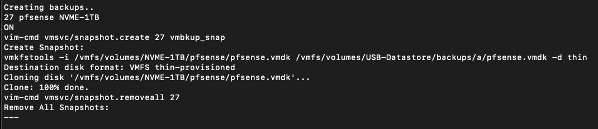

# vmbkup.py #

 A simple python script to run as root on an ESXI host to produce backups (clones) of the running virtual machines and the host config bundle (which is automatically downloaded and placed in the backup folder)

<mark>USE AT YOUR OWN RISK!</mark>

This is still a work in progress, but it is mostly functional.

'vmbkup' uses snapshots to enable cloning of running virtual machines.

You must specify the backup datastore location (which must already be configured and available) BEFORE running the script!

Backups are stored in a primary/secondary fashion.  When the tool is run, the secondary location is purged and the primary is then moved to the secondary folder and new backups are placed into the primary folder ensuring that there are two backups available when the process completes.

## TODO 
- Add better error checking around the os level functions
- Add logging
